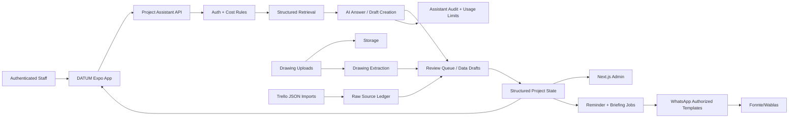
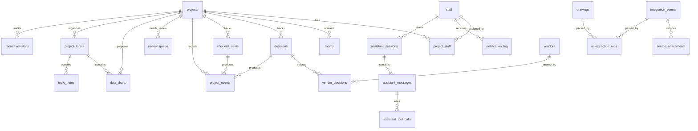

# DATUM - WHAstudio Project Intelligence System Software Architecture Plan

**Version:** 0.2  
**Date:** May 27, 2026  
**Purpose:** Companion architecture plan for `whastudio-ai-blueprint.md`
**Product name:** DATUM

---

## 1. Architecture North Star

DATUM should become WHAstudio's operational memory: a reliable, queryable layer that turns scattered field updates, client decisions, drawings, photos, and reminders into structured project state.

The most important design principle:

> Preserve raw inputs, structure them with AI, and require human review at the moments where mistakes would cost the project.

This means the app should not behave like a magical black box. Every AI-derived output should point back to the original app entry, Trello import, client-conversation note, photo, or drawing page that produced it.

---

## 2. Recommended V1 System Shape

For Phase 1, keep the architecture deliberately compact:

| Area | Recommendation | Why |
| --- | --- | --- |
| Native App | Expo / React Native | Primary DATUM staff interface for project topics, structured filters, Project Assistant, photos, and future offline workflows. |
| Web Admin | Next.js | Admin, import, review queue, dashboards, API routes, and heavier validation workflows. |
| Database | Supabase Postgres | Relational state, auditability, roles, and realtime updates. |
| Auth | Supabase Auth | Fastest path to role-based internal dashboard access. |
| Files | Supabase Storage | Central place for app photos, drawings, extraction references, Trello attachments, and completion photos. |
| WhatsApp | Fonnte or Wablas notification sender | Outbound notification-only channel. No inbound WhatsApp behavior in V1. |
| AI | Internal assistant service module | Keep prompts, schemas, retrieval, draft creation, source citation, usage limits, and provider-specific code out of UI code. |
| Jobs | Vercel cron plus Supabase tables for job state | Enough for daily briefs and reminders before adding a worker queue. |

Defer a separate FastAPI service until there is a real reason: heavy background processing, long-running drawing extraction, complex OCR pre-processing, or many integrations.

---

## 3. Core Bounded Contexts



### 3.1 Identity And Permissions

Responsible for:
- Staff records
- Roles and permissions
- WhatsApp notification number ownership
- Project assignments
- Dashboard access control

Tables:
- `staff`
- `project_staff`
- Supabase Auth users

Important rule:
- App identity, dashboard identity, and notification identity should map to the same `staff.id`. WhatsApp numbers are for outbound notifications, not data access.

### 3.2 Project Registry

Responsible for:
- Canonical project list
- Project codes
- Client/site-address aliases
- Client/location metadata
- Project status
- Room list

Tables:
- `projects`
- `rooms`

Important rule:
- Project lookup prioritizes client name and site address because the team usually refers to projects that way. `project_code` remains a unique secondary identifier for precision and integrations.

### 3.3 Ingestion Ledger

Responsible for:
- Capturing Trello imports, app/assistant inputs, drawing uploads, and outbound notification events
- Capturing attachments before interpretation
- Preventing duplicate writes from repeated imports or retried jobs
- Preserving the raw source of truth

Tables to add or refine:
- `notification_log`
- `source_attachments`
- `integration_events`

Important rule:
- The system should write raw imports, assistant inputs, and notification events before interpretation. If AI fails, the original source is still saved and reviewable.

### 3.4 AI Extraction

Responsible for:
- Answering authenticated app queries from structured data with cost-visibility filtering
- Creating structured data drafts from natural-language app input
- Parsing drawing uploads into rooms, finishes, and checklist drafts
- Producing confidence scores and explanations
- Routing ambiguous data to review

Tables to add:
- `ai_extraction_runs`
- `review_queue`
- `assistant_sessions`
- `assistant_messages`
- `assistant_tool_calls`
- `assistant_query_audit`
- `assistant_usage_limits`
- `data_drafts`

Important rule:
- Store AI output as JSON, but convert approved results into typed relational tables. JSON is the receipt, not the long-term application model.

### 3.5 Project State

Responsible for:
- Decisions
- Finish checklist
- Blockers
- Status changes
- Completion records

Tables:
- `decisions`
- `checklist_items`
- `vendors`
- `vendor_decisions`

Recommended addition:
- `project_events`

Why add `project_events`:
- `decisions` and `checklist_items` are specific objects. WHAstudio also needs a general timeline: "photo uploaded", "decision superseded", "checklist item completed", "drawing parsed", "reminder sent", "PIC reviewed ambiguous message". A timeline table gives every project one readable history.

Recommended addition:
- `record_revisions`

Why add `record_revisions`:
- All staff can approve and correct visible records, so the system must never erase earlier information. Corrections and superseded decisions need an append-only audit trail.

### 3.6 Review And Correction

Responsible for:
- Medium-confidence AI outputs
- Low-confidence clarification loops
- Carissa's drawing validation workflow
- Manual corrections without losing source traceability

Tables:
- `review_queue`
- `review_actions`

Important rule:
- A correction should create a visible action trail. The system should answer: who changed the AI result, when, and why?

### 3.7 Reminders And Briefings

Responsible for:
- Scheduled WhatsApp reminders
- Wilson's morning brief
- PIC follow-ups
- Escalations

Tables:
- `reminders`
- `briefing_runs`
- `briefing_items`

Important rule:
- Reminders should be generated from project state, but not sent blindly. V1 can queue suggested reminders for review before automatic sending is enabled.

---

## 4. Event Flow: Internal Assistant

1. Staff asks a question or adds data inside DATUM.
2. App calls `POST /api/assistant/message`.
3. Server verifies Supabase Auth and resolves `staff.id`.
4. Server checks active staff status, broad project access, and cost-visibility permissions.
5. Server checks `assistant_usage_limits`.
6. Server retrieves approved structured records first: topics, decisions, drawing updates, schedules, surveys, invoices, workers, progress logs, notes.
7. Server may include flagged drafts only if labeled as unapproved.
8. AI either answers with source citations or creates a `data_drafts` record.
9. Server logs `assistant_messages`, `assistant_tool_calls`, and `assistant_query_audit`.
10. App displays answer, sources, and any draft awaiting approval.

Key implementation detail:
- The assistant never queries raw imported comments first. Raw Trello/WhatsApp history is source evidence, not the main operating model.

## 4.1 Event Flow: WhatsApp Notification Only

1. System creates a reminder, review item, or morning-brief alert.
2. Server calls `POST /api/notifications/whatsapp/send`.
3. Server verifies recipient is active staff and authorized for the notification type.
4. Server renders an approved template.
5. Message may include project details for authorized staff; cost-sensitive details require cost visibility.
6. WhatsApp provider sends the notification.

There is no inbound WhatsApp product behavior in V1. WhatsApp must not answer inbound project questions or auto-reply with data. Outbound WhatsApp notifications may include project details when generated by the system for authorized staff. Cost, invoice, vendor-price, VO, and margin-sensitive details only go to principals and selected cost-visible PICs/project managers.

All system event categories may generate WhatsApp notifications when enabled for that role/project, including approvals, overdue decisions, schedule risks, client decision updates, drawing updates, survey notes, invoice/cost events for cost-visible roles, and morning briefs.

---

## 5. Event Flow: Drawing Upload And Checklist Generation

1. Dashboard user uploads PDF/JPG/PNG drawing.
2. File is stored in Supabase Storage.
3. `drawings` row is created with `parsed = false`.
4. Extraction job is created in `ai_extraction_runs`.
5. AI reads the file or page images and returns structured draft JSON:
   - rooms
   - finish items
   - drawing references
   - confidence per item
6. Draft results are shown in a validation UI.
7. Carissa edits and approves the draft.
8. Approved draft writes to:
   - `rooms`
   - `checklist_items`
   - `project_events`
9. Original AI output remains stored for audit and future prompt tuning.

V1 rule:
- Drawing extraction should never directly create final checklist items without review.

---

## 6. Suggested Database Refinements

The blueprint's schema is a strong starting point. I would add these before implementation:



### `project_events`

Append-only timeline for all important project activity.

Core columns:
- `id`
- `project_id`
- `event_type`
- `title`
- `body`
- `source_type`
- `source_id`
- `actor_staff_id`
- `created_at`
- `metadata jsonb`

### `record_revisions`

Append-only correction and supersession history.

Core columns:
- `id`
- `project_id`
- `entity_type`
- `entity_id`
- `revision_type`
- `previous_payload_jsonb`
- `new_payload_jsonb`
- `actor_staff_id`
- `reason`
- `created_at`

### `source_attachments`

Avoid storing attachment URLs only as arrays inside `decisions`.

Core columns:
- `id`
- `source_type`
- `source_id`
- `storage_path`
- `mime_type`
- `original_url`
- `caption`
- `created_at`

### `notification_log`

Audit trail for outbound WhatsApp and app notifications.

Core columns:
- `id`
- `provider`
- `recipient_staff_id`
- `project_id`
- `notification_type`
- `template_key`
- `rendered_summary`
- `deep_link_url`
- `status`
- `provider_message_id`
- `estimated_cost_usd`
- `created_at`
- `sent_at`

### `ai_extraction_runs`

One table for every AI parse/extraction attempt, whether assistant draft creation, Trello classification, or drawing extraction.

Core columns:
- `id`
- `source_type`
- `source_id`
- `model`
- `prompt_version`
- `input_summary`
- `output_jsonb`
- `confidence`
- `status`
- `error_message`
- `created_at`

### `review_queue`

One place for ambiguous messages, medium-confidence parses, and drawing validation tasks.

Core columns:
- `id`
- `project_id`
- `review_type`
- `source_type`
- `source_id`
- `assigned_to_staff_id`
- `priority`
- `status`
- `created_at`
- `resolved_at`

### `integration_events`

Raw provider payloads for debugging and idempotency.

Core columns:
- `id`
- `provider`
- `provider_event_id`
- `payload_jsonb`
- `received_at`
- `processed_at`
- `status`

### `data_drafts`

Draft records created by the assistant, Trello import classifier, or drawing extraction before becoming official records.

Core columns:
- `id`
- `project_id`
- `topic_id`
- `draft_type`
- `proposed_payload_jsonb`
- `risk_level`
- `approval_required_role`
- `status`
- `created_by_staff_id`
- `approved_by_staff_id`
- `source_type`
- `source_id`
- `created_at`
- `approved_at`

### Assistant Audit Tables

The internal chatbot needs durable cost, source, and access logs.

Core tables:
- `assistant_sessions`
- `assistant_messages`
- `assistant_tool_calls`
- `assistant_query_audit`
- `assistant_usage_limits`

---

## 7. Application Module Layout

Recommended initial repo structure:

```txt
whastudio-intelligence/
  app/
    (auth)/
    dashboard/
    projects/
    review/
    settings/
    api/
      integrations/
        assistant/
          message/
          drafts/
        notifications/
          whatsapp/
            send/
      ai/
      cron/
  components/
    project/
    decisions/
    checklist/
    review/
    ui/
  lib/
    supabase/
    auth/
    ai/
      project-assistant.ts
      assistant-retrieval.ts
      assistant-drafts.ts
      parse-drawing.ts
      schemas.ts
      prompts/
    integrations/
      whatsapp/
        notification-provider.ts
        fonnte.ts
        wablas.ts
    domain/
      projects.ts
      decisions.ts
      checklist.ts
      events.ts
    validation/
  supabase/
    migrations/
    seed/
  docs/
    architecture.md
    prompts.md
    operating-playbook.md
```

The UI and backend can live together, but domain logic should not be trapped inside page components. Parsing, project resolution, event creation, and reminder generation should live in `lib/` so they can later move into jobs or a separate service if needed.

---

## 8. Security And Access Model

Suggested roles:

| Role | Dashboard Access | Typical Powers |
| --- | --- | --- |
| Principal | Full | All projects, settings, briefings, analytics, costs |
| Admin | Broad | Staff, projects, review queue, corrections; cost access only if granted |
| Designer | Broad | All project memory, drawings, rooms, finishes; no cost access by default |
| PIC / Project Manager | Broad | All project memory and approvals; cost access only if selected |
| Site supervisor | Broad | Project memory, notes, progress, photo logs; no cost access by default |

V1 approach:
- Use Supabase Auth for dashboard users.
- Use broad project read access for active staff, with cost-sensitive tables/fields restricted to principals and selected PICs/project managers.
- Keep role and permission assignment configurable; Wilson can designate exact roles and cost-visible users later without schema changes.
- Allow active staff to approve visible drafts to reduce bottlenecks.
- Enforce append-only correction history through `project_events` and `record_revisions`.
- Use a server-side service role only in API routes where needed.
- Treat WhatsApp as an outbound notification channel only. Do not build inbound WhatsApp query or auto-reply behavior in V1.
- Assistant answers must be generated only after auth, cost-visibility filtering, usage-limit checks, and source logging.

Important privacy decision:
- Client-facing access should remain out of V1. Internal accuracy matters before exposing state to clients.

---

## 9. AI Design Principles

### Prompting

Prompts should be versioned in code. Every `ai_extraction_runs` row should store the `prompt_version` so bad parses can be traced to a prompt version.

### Output Contracts

Use strict JSON schemas. The parser should only output allowed enums for:
- project status
- decision type
- decision status
- checklist status
- confidence route

### Human Review

AI can draft:
- message classification
- decision records
- checklist item matches
- drawing extraction
- reminder suggestions

AI should not be the final authority for:
- drawing-derived checklist creation
- vendor choice
- budget or quote approval
- client-facing status
- anything that changes contractual scope

### Cost Control

Use model routing instead of one expensive model for everything:
- Database filters and status badges should not call AI.
- Cheap/fast models handle classification, draft typing, query rewriting, and short source-grounded answers.
- Stronger models handle cross-project synthesis, messy Bahasa notes, drawing interpretation, and high-impact summaries.
- Cache daily project/topic summaries so repeated assistant questions do not resend large context.
- Enforce hard daily/monthly caps in `assistant_usage_limits`, with automatic downgrade to filter-only mode if the pilot budget is exceeded.

### Language

- DATUM assistant answers default to Bahasa Indonesia.
- Source text may remain in its original language, but summaries, prompts, and draft labels should be Bahasa by default.

---

## 10. Dashboard Information Architecture

V1 screens:

1. **Projects**
   - All active projects
   - Status, PIC, last update, unresolved items

2. **Project Detail**
   - Timeline
   - Decisions
   - Rooms
   - Checklist
   - Drawings
   - Attachments

3. **Decision Feed**
   - Filter by project, room, status, type, logged by

4. **Review Queue**
   - Trello import drafts
   - Assistant-created drafts
   - Medium-confidence parses
   - Drawing extraction approvals

5. **Staff And Assignments**
   - Staff list
   - WhatsApp notification numbers
   - Project assignments

6. **Project Assistant**
   - Natural-language query
   - Draft creation
   - Source citations
   - Usage/cost guardrails

7. **Morning Brief** later in Phase 3
   - Principal-level prioritized risk list

The first screen after login should probably be project operations, not a marketing-style landing page. This is an internal work surface.

---

## 11. Build Sequence

### Sprint 0: Foundation

- Create Expo app and Next.js admin/API app
- Connect Supabase
- Add migrations for core schema
- Add seed data for pilot users/projects
- Add basic auth and role model
- Add simple dashboard shell

### Sprint 1: Project Operating Database

- Projects list
- Project detail
- Staff assignment management
- Rooms table
- Decision CRUD
- Project event timeline

### Sprint 2: Internal Assistant

- Authenticated assistant endpoint
- Broad project retrieval with cost-visibility filtering
- Bahasa Indonesia default answer style
- Source citations
- Data draft creation
- Usage limits and query audit
- Review queue for assistant drafts

### Sprint 3: Pilot Dashboard

- Decision feed
- Filters
- Review and correction flow
- Attachment display
- Safe WhatsApp notification endpoint
- Basic metrics: assistant usage, draft volume, approval aging, queried projects

### Sprint 4: Drawing Upload Draft

- Drawing upload
- Extraction run storage
- Validation UI
- Approved extraction writes rooms/checklist items

This sequence gives WHAstudio a usable internal tool before the hardest AI drawing work is finished.

---

## 12. Architecture Decisions To Brainstorm Next

These are the decisions worth making together before scaffolding code:

1. **Backend boundary**
   - Recommendation: start with Next.js API routes.
   - Open question: do we expect drawing parsing to be slow enough that we want a separate worker earlier?

2. **Canonical project event model**
   - Recommendation: add `project_events` from day one.
   - Open question: should every decision/checklist update create an event automatically?

3. **WhatsApp notification behavior**
   - Decision: no inbound WhatsApp product behavior in V1.
   - Decision: all system event categories may trigger outbound WhatsApp notifications when enabled.

4. **Trello migration**
   - Decision: run Trello and the new app in parallel during pilot.
   - Recommendation: import active project boards first, then decide whether to sunset Trello after 8 weeks of stable use.

5. **Drawing source of truth**
   - Recommendation: Supabase stores operational uploads; NAS remains master design storage.
   - Open question: should drawing uploads be manual in V1, or should the app know NAS file paths?

6. **Staff adoption mechanics**
   - Recommendation: train users around project topics plus structured child records.
   - Decision: active staff can approve visible drafts; cost-sensitive drafts are visible only to principals and selected cost-visible PICs/project managers.

---

## 13. My Recommended Next Move

Build the smallest architecture slice that proves the whole system:

1. Create the app shell and database.
2. Add staff, projects, assignments, project topics, decisions, drafts, and project events.
3. Import Trello boards into topics/source records.
4. Add the internal Project Assistant with Bahasa defaults, broad project retrieval, cost filtering, and draft creation.
5. Use WhatsApp only for authorized notification templates.

This avoids exposing project data through WhatsApp and proves the daily operating loop inside the app before expanding drawing extraction and proactive intelligence.
